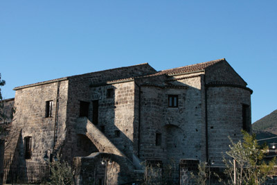
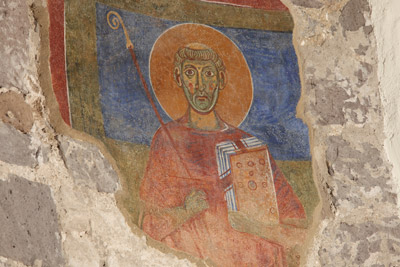

# Abbazia benedettina del Santo Salvatore

La millenaria storia dell’Abbazia benedettina di San Salvatore Telesino ci consente di immergerci in un territorio che è tra i più suggestivi di tutta la regione Campania. Con le profonde cavità carsiche di monte Pugliano (i puri), convivono da secoli rilevanti testimonianze di età sannita (ricordiamo i resti della cinta muraria presente sulla Rocca) e romana come l’Anfiteatro dell’antica Telesia (di recente riportato alla luce) contornato da un’imponente struttura muraria che nei secoli ha resistito a tanti terremoti e ancora oggi accompagna la vita di coloro che vivono tra San Salvatore e Telese Terme.
La storia dell’abbazia connota la prima metà del secondo millennio del percorso storico della Valle Telesina, proponendoci squarci di storia politico - religiosa del Sud Italia interessanti e spesso poco conosciuti. Alcuni studiosi come Libero Petrucci fanno risalire la sua fondazione al duca longobardo di Benevento, dal 774 al 787, Arechi II, mentre Angelo Iannachino ne data la nascita al sec. IX identificandola come “cella” di Montecassino. L’assetto strutturale del cenobio benedettino presenta le caratteristiche peculiari dell’architettura conventuale di epoca normanna, si ergevano generalmente strutture religiose su precedenti insediamenti di età romana, forse l’abbazia fu eretta sui resti di un’antica villa, come hanno accertato gli scavi archeologici del 1991 e del 2007. L’interno si presenta con un impianto  a tre navate e termina in un transetto sporgente che immette in un coro.

Gli storici che si sono attentamente occupati della nostra abbazia, sottolineano come sia stato vitale per lo sviluppo del messaggio cristiano nella nostra realtà territoriale il soggiorno presso il convento di Anselmo d’Aosta nell’estate del 1098, quando l’allora arcivescovo di Canterbury fu invitato a Roma dal papa Urbano II. La “Storia di Telesia” dello Iannachino, ci dice che l’abate Giovanni, superiore dell’abbazia di San Salvatore alla fine del sec. XI e discepolo di Anselmo quando questi era stato abate presso il monastero di Bec in Normandia nel 1078, convinse il teologo di Aosta a soggiornare a San Salvatore. Secondo quanto è riportato nel testo, il frate e biografo di Anselmo, Edmero, sostiene che durante la permanenza nell’abbazia, il grande teologo avrebbe scritto il suo capolavoro,”Cur Deus homo”; al santo aostano è ancora oggi  dedicato un pozzo che serviva per le esigenze dei frati.

Un altro personaggio storico legato strettamente alle sorti dell’abbazia fu il re normanno di Sicilia, Ruggiero II, al quale un importante abate, Alessandro Telesino, dedicò una biografia, “De rebus gestis Ruggierii Siciliae Regis”, nella quale riporta la notizia che Ruggiero fu ospite della badia nel 1134 e nel 1135, il sovrano donò al monastero oltre che oro ed argento la “collina di Massa Superiore, il feudo di Carattano e la Villa degli Schiavi”. Un ulteriore elemento che ci autorizza a credere che tra i secc. XI e XIII l’abbazia di San Salvatore abbia svolto un ruolo importante nella vita religiosa di questa parte dell’Italia Meridionale è un atto notarile dal quale si evince che quando nel luglio del 1237 il “monaco cassinese”, Giovanni da Capua fu consacrato abate di San Salvatore da papa Gregorio IX (fu colui che scomunicò l’imperatore Federico II di Svevia), il re Carlo II d’Angiò ne pretese un giuramento di fedeltà. La storia della nostra abbazia si intreccia con le storie di altri siti benedettini presenti in Italia Meridionale, tutti a loro volta dipendenti dalla casa madre di Montecassino, presso la quale dall’Alto Medioevo era un funzione uno straordinario laboratorio di realizzazione di codici miniati che con le loro immagini tratte dall’arte bizantina hanno irradiato in tutto il Sud Italia la maniera pittorica dell’Impero Romano d’Oriente, prima del soggiorno napoletano di Giotto e dell’arrivo di Pietro Cavallini,  proprio a qualche suo valente seguace penetrato nell’entroterra campano si potrebbero attribuire i cicli di affreschi conservati nella cappella di Sant’Antonio a Sant’Angelo d’Alife ed in quella di San Biagio a Piedimonte Matese.

Le scarne immagini dipinte che ritroviamo nell’abbazia sono dei frammenti di affreschi e sono collocati presso l’abside.

Al centro possiamo osservare dei resti acefali di figure sacre, forse apostoli o santi, sei superiori e sei inferiori. E’ probabile, come sostiene il prof. Pacelli dell’Università di Napoli, che queste “erano completate da tavole circolari con i volti dipinti, usanza che si ritrova a Napoli nella cattedrale di Santa Restituta”(si tratta di una basilica del IV secolo d.C., che fa parte del complesso del duomo di Napoli). Nella parte laterale destra dell’abside troviamo raffigurato San Benedetto, nella parte sinistra, invece, Santa Scolastica, sorella del santo di Norcia, mentre sorregge un tralcio di gigli ed un libro sacro incastonato, a sinistra della santa, osserviamo l’immagine di un santo con pastorale e libro sacro.

Gli affreschi, restaurati nel 2007, potrebbero risalire ai secc. XII e XIII, sono un apprezzabile esempio di pittura sacra che risente della guisa gotica-bizantina.La datazione, sulla quale concordano storici dell’arte e restauratori è riconducibile al periodo di maggior fortuna del monastero, quando cioè arrivavano copiose le donazioni dei signori locali e le prebende incassate dai monaci sulle proprietà fornivano ricchezza sufficiente per abbellire i locali dell’ecclesia, è questo il periodo durante il quale è numericamente notevole anche la presenza dei frati.

Dopo le fortune medioevali e la successiva crisi del monachesimo benedettino, l’abbazia dal 1448 fu guidata da una serie di abati “commendatari” . Nel sec. XVI divennero commendatari alcuni rappresentati della famiglia dei Monsorio, signori del comprensorio di origine longobarda.  Nel Seicento la sorte della badia  passò per alterne vicende, fin quando con l’arrivo della dinastia borbonica, tutti i beni furono devoluti alla corona. Alla fine del Settecento con l’occupazione militare francese e l’abolizione dei privilegi feudali, la commenda fu messa in vendita e rilevata dalla famiglia Pacelli, signori della zona. Agli inizi del Novecento gli ambienti dell’abbazia ospitarono uno stabilimento vinicolo e dal 1923 si aggiunse un mulino molto conosciuto nella zona e che è stato attivo fino alla fine degli anni Sessanta del Novecento. Di notevoli dimensioni sono gli ambienti sotterranei della badia nei quali attraverso i secoli sono stati stipati i prodotti della terra coltivati dai conventuali in loco e presso gli altri possedimenti.

Nel corso dello scavo del 2007 sono state rinvenute due tombe, in una delle quali sono stati rintracciati i resti di due individui sistemati “l’uno sull’altro”, l’arredo funerario di uno di loro, composto da collana e anello, fa ipotizzare che si tratti di una donna.

Attualmente la “Nuova Abbazia” funge da contenitore di eventi culturali ed attualmente ospita un Antiquarium con i reperti dell’antica Telesia.

(testo a cura di: Domenico Tescione)