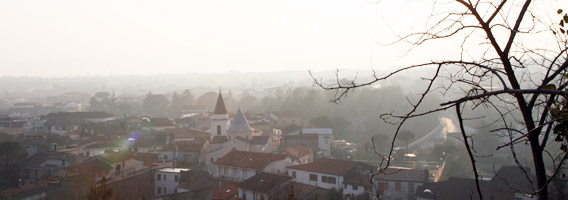
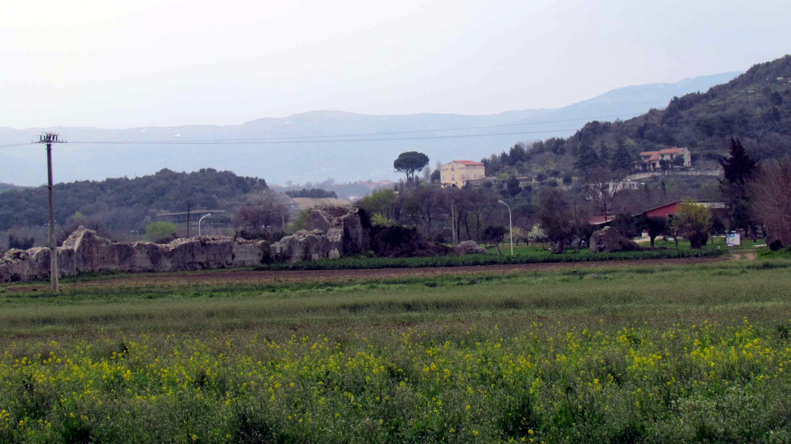
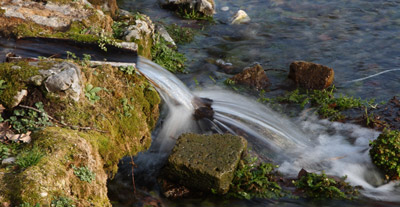

# Il Paese
## San Salvatore Telesino

Situato ai piedi di un colle, sulla cui vetta è la [Rocca del Casale](rocca_del_casale.md), San Salvatore Telesino (m 95 slm) rappresenta, per la sua conformazione geografica (tranquillo paese della vallata circondato dal verde delle colline di Monte Pugliano, Selva Palladino, San Manno) e le testimonianze di un ricco ed illustre passato, una meta da visitare e conoscere nei percorsi turistici della Campania.

 La sua nascita deriva dalla frammentazione di [Telesia](telesia.md), città prima sannita e poi romana, centro di importanza cruciale ai tempi delle guerre puniche.
 

 Ancor più rappresentativa dell’identità locale è la solenne [Abbazia del Santo Salvatore](abbazia.md), che dà il nome al paese. Nei suoi pressi si stabilì un nucleo di abitanti scampati alla rovina di Telesia, in un casale fatto costruire dai Benedettini, che governavano il complesso.
 Suo abate fu **Alessandro Telesino,** autore della storia De rebus gestis Rogerii Siciliae Regis. La badia risale al X sec. e comprende una chiesa a tre navate con lungo transetto, impreziosita da raffinati affreschi dell’abside. Tra i numerosi ospiti illustri dell’Abbazia, figurò l’Arcivescovo di Canterbury, **Sant’Anselmo**. Oltre all’Abbazia, altro simbolo di San Salvatore Telesino rimane il castello della Rocca (costruito dai Sanframondo) e [Monte Acero](monta_acero.md) che, oltre ad ospitare la statua dedicata a Gesù Redentore, conserva i resti di una cinta muraria, una delle numerose fortificazioni costruite in opera poligonale dai Sanniti.Nel centro storico di San Salvatore Telesino sorge la [Chiesa di Santa Maria Assunta](chiesa_assunta.md). Edificata nella prima metà del XVI sec., la chiesa presenta oggi una pianta a croce latina con tre navate divise da pilastri e tre cappelle principali: due sono poste lungo i lati della navata centrale, la terza è innestata nel transetto dell’altare maggiore. Tale cappella, risalente al XIII sec., rappresenta il nucleo più antico. Essa divenne nel 1518, con la morte del duca Vincenzo, la cappella sepolcrale dei **Monsorio**. Il patrimonio della Chiesa annovera, inoltre, pregiati dipinti: la *Trasfigurazione*, pregiatissima tela attribuita a **Luca Giordano** e collocata sull’altare maggiore; *San Leucio tra gli angeli e Ultima Cena* di **Antonio Sarnelli** (prospiciente l’entrata); *Assunzione della Vergine* di **Francesco Celebrano** (navata destra).

 

 Nel territorio di San Salvatore Telesino sgorga una copiosa acqua solfurea a 22°C, usata localmente per la cura della pelle e di svariate affezioni dell’apparato respiratorio e digerente. La stessa acqua viene utilizzata per trattamenti fisioterapici ed estetici.

 Non mancano, inoltre, bellezze naturali che invitano a percorrere sentieri selvaggi tra forme particolari di erosione sul [Monte Pugliano (i Puri)](puri.md), e a vivere un contatto più diretto con una natura incontaminata visitando il parco del [Rio Grassano](grassano.md).
 
 

 Tra le attività economiche del paese, l’agricoltura riveste senza dubbio un ruolo importante.La genuinità e la semplicità che caratterizzano il territorio di San Salvatore Telesino si ritrovano anche nei sapori della tavola e nell’aroma di vini pregiati. La cucina si lega alla tradizione contadina (prodotti agricoli ed ortofrutticoli), ed in essa è possibile riscoprire tracce di odori e di sapori che oggi tendono sempre più a scomparire. Ancora oggi è possibile degustare [lo struppolo](struppolo.md), il tipico rustico della tradizione culinaria di San Salvatore Telesino, inserito nel 2013 tra i *Prodotti Agroalimentari Tradizionali Campani*,  realizzato con un impasto a base di uova, preparato con cura e dedizione dalle massaie locali. Per gli appassionati di arte, storia, natura, San Salvatore Telesino rappresenta la meta ideale; la bellezza del suo paesaggio incontaminato, il suo passato ricco di storia, i genuini prodotti enogastronomici ne fanno un angolo di mondo di grande attrattiva.

