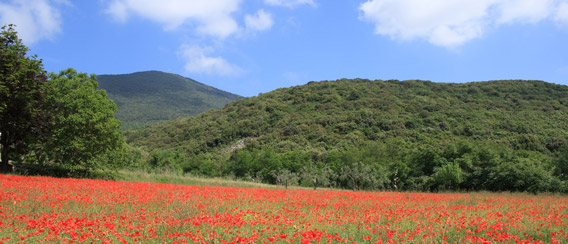

# Monte Acero

E’ stato nei secoli la montagna che ha, per così dire, protetto con la sua imponenza la comunità di San Salvatore Telesino ed ha fatto da sentinella alla vita di tutta la **Valle Telesina**. Posta a settentrione di San Salvatore Telesino, tra il monte Erbano e il monte Pugliano, la montagna si eleva isolata fino alla quota di **736 msl**. La sua caratteristica forma conica non è, contrariamente a quanto ritenuto in passato, il frutto di un’intensa attività vulcanica bensì conseguenza dell’erosione, profonda e marcata, del vicino fiume Titerno sui materiali calcarei. Oggi la montagna si presenta calma e maestosa, ammantata da una fitta vegetazione composta da lecci, aceri e carpini nella fascia sommitale, da pino domestico nella fascia intermedia e da ulivi sistemati a mezze lune nella fascia basale. La vetta del monte è cinta da circa tre kilometri di mura megalitiche di età osco sannita (VI secolo a.C.) che costituivano la cosiddetta “Arce di Monte Acero“, una fortificazione usata dai **Sanniti** come importante punto di avvistamento e che la fantasia popolare, non immaginandola opera dell’uomo, chiamò e continua a chiamare “mura delle fate”.  Le mura sono costituite da grossi massi di pietra squadrati e disposti a secco. La parte meglio conservata è quella lontano dai sentieri e che corre verso la parte meridionale della montagna. Due sono le aperture che si individuano nelle mura e che sono originarie: una a meridione, verso Telesia, ed un’altra verso settentrione. La forma dei blocchi di pietra tende ad essere rettangolare e lo spazio che si viene a formare fra i vari blocchi è riempito da pietrame. L’altezza media è di 3,5 metri. Oltre alle mura megalitiche, un’altra importante attrazione presente sul Monte Acero è rappresentata dalla **statua del Redentore**, un monumento in ghisa che si erge sulla vetta a levante del monte. La statua è posta al di sopra di una base piramidale quadrangolare in conci di pietra lavorata con all’interno una angusta cappella. Il monumento venne eretto nel 1902 sotto l’impulso di Papa Leone XIII, uomo di profonda religiosità e cultura, che per rinverdire la fede inaridita dalle ultime vicende dell’Ottocento promosse come omaggio a Cristo Redentore la costruzione di croci e statue su venti cime della penisola. La statua fu realizzata dalla ditta Rosa Zanazio di Roma. All’epoca costò ben 4.000 lire circa, una cifra importante, sovvenzionata dalle offerte provenienti da tutta la Diocesi. Contestualmente all’erezione del monumento il comitato propose la costruzione, alle falde della montagna, di una casa di ricovero per gli ammalati di tubercolosi, anche se nulla in tal senso fu fatto per mancanza di fondi. Maestosa ed espressiva e dallo sguardo dolcissimo, la statua del Redentore vegliò sulla vallata fino alla notte del 30 dicembre del 1974, quando un vento ciclonico la infranse al suolo. La statua fu restaurata nel 1979 nelle officine Pironti di Napoli grazie alla generosità dell’imprenditore Emilio Bove e fu rimessa sul suo basamento dove attualmente è ben conservata ed è facilmente raggiungibile attraverso una strada che si snoda dalla Contrada Cese San Manno attraverso una fitta e suggestiva vegetazione.Ogni anno, per ricordare l’erezione del monumento, la prima domenica di agosto di primo mattino si svolge un pellegrinaggio che parte da Cerreto Sannita.