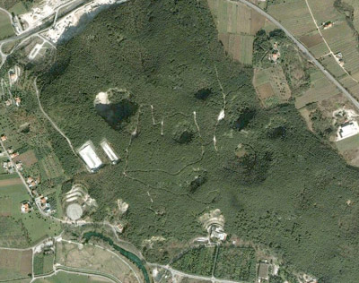

#  I Puri di monte Pugliano
La collina di Pugliano altro non è che il prolungamento orientale di Monte Acero. Sebbene venga ricordata soprattutto  come luogo funesto dell’epicentro sismico del 1349, vi sono ben altri motivi per cui Pugliano merita una citazione: essa è stata certamente abitata fin dai tempi più remoti. Lo dimostra la scoperta di una capanna-ovile di epoca preistorica, descritta con dovizia di particolari dallo studioso Abele De Blasio.

Addirittura un’antica leggenda vuole che dalla piccola comunità di Montepugliano alcuni abitanti si siano portati più a valle, verso le sponde del fiume Volturno dando origine così ad un nuovo agglomerato. Il quale, per ricordare la sua provenienza, prende il nome di piccola Pugliano: Puglianello. Attraversando la sommità di monte Pugliano ancora oggi appaiono evidenti, ampie e profonde voragini, simili a crateri o bocche di vulcano, che la nostra gente definisce comunemente  puri e che rappresentano meta di escursioni per gli appassionati di fenomeni naturali. Lo stesso De Blasio nel suo studio sulla capanna-ovile ne fa menzione descrivendone quattordici ma precisando nel contempo di non poter stabilire quando si formarono questi burroni.

Così dice: “intorno all’epoca in cui avvennero tali sprofondamenti, di 13 di essi non è rimasta memoria; uno si formò circa un secolo e mezzo fa e tutti, indistintamente, divennero più profondi in occasione del terremoto del 1815“. Qualche studioso ha ipotizzato l’origine del termine puri dal greco πῦρ = fuoco. Se ne riconosce in tal modo, almeno indirettamente, una origine vulcanica. In uno studio del secolo scorso, anche il Perrotta è caduto in errore ritenendo dette cavità dei veri e propri crateri vulcanici. Tale ipotesi, priva di qualunque fondamento, è tra l’altro ampiamente smentita da un fatto inequivocabile: sulla collina di Pugliano non è presente nemmeno la minima traccia di roccia vulcanica.

I Puri di Monte Pugliano debbono dunque la loro genesi sicuramente all’azione erosiva dell’acqua. L’antico aforisma latino “gutta cavat lapidem” mai come in questi casi sembra più appropriato: le acque carsiche contenute all’interno della montagna da tempo immemorabile, con la loro azione erosiva procurano delle fratture al suolo e delle sconnessioni in tutto il sistema roccioso. Ciò conduce alla formazione di meati interni che, sottoposti a loro volta a continue erosioni, determinano la formazione di ampie caverne in progressivo mutamento.

anto è vero che le pareti di tali caverne dimostrano tutta la precarietà del loro equilibrio quando al minimo sommovimento della roccia circostante, sprofondano originando i Puri.

Lo scuotimento sismico rappresenta la principale causa degli sprofondamenti. “Le volte di tali caverne, continuamente assottigliate dall’aggressività millenaria delle acque che passano rombando verso la loro scaturigine, alle prime scosse crollano e migliaia di metri cubi di roccia piombano nei fiumi sotterranei bloccandone il corso” (A. Romano, Le Terme di Telese, De Martini, Benevento, 1971, pag. 13). I Puri quindi non hanno una origine vulcanica ma nascono per lo sprofondamento di caverne interne alla montagna; secondo A. De Blasio il loro nome popolare è in definitiva una semplice corruzione “putei” dato che tali sprofondamenti, visti da lontano, assomigliano a tanti pozzi. Appare evidente come molti di questi puri originano in conseguenza del terremoto del 1349. Il sisma, stando a quanto viene riferito, deve aver assunto proporzioni davvero catastrofiche; basti pensare che proprio in quell’occasione originano le mofete e le acque solfuree. I puri hanno svolto la funzione di deposito piovano, offrendosi oggi come luogo di suggestione quasi lunare, che ben si addice alla dimensione fantastica della città. Il Puro Grande, o Puro delle Mele, presenta un dislivello di circa 100 m rispetto al piano di superficie. Il Puro Piccolo, l’unico visitabile, ha un dislivello di circa 80 m. uno stretto sentiero, realizzato lungo i fianchi della dolina permette al visitatore di raggiungere il piano basale. La discesa, piacevole e poco impegnativa, è un lento immergersi nella vegetazione rigogliosa ed incontaminata.

