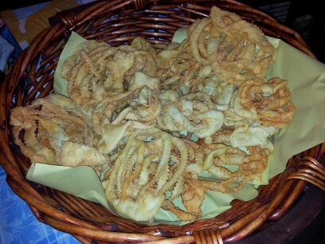

# Vanti

Frittelle con listarelle intrecciate tra loro che danno luogo ad una forma grossolanamente rotonda, di colore dorato , del peso di circa 10-20gr., di sapore sapido e speziato, friabili di consistenza.

Ingredienti: farina di grano tenero, olio extravergine di oliva, uova freschissime, sale, un pizzico generoso di pepe, olio abbondante per la frittura. Impastare su una spianatoia in legno tutti gli ingredienti. Far riposare per circa mezz’ora. Stendere con il mattarello l’impasto in una sfoglia sottilissima, suddividerla quindi in tanti cerchi all’interno dei quali andranno effettuati con il taglia pasta alcuni tagli paralleli tra loro, sollevare con le dita ed in maniera alternata le striscioline così formatesi e rovesciarle velocemente. Far riscaldare in una pentola l’olio per la frittura. Quando la temperatura dell’olio sarà elevata, cominciare a tuffarvi i vanti, pochi alla volta, fin quando avranno preso un bel colore dorato. Lasciar scolare ed asciugare su della carta da cucina.

Nella tradizione popolare non vi è memoria di modalità di preparazione differenti da quelle attuali. Ancora oggi si preparano in occasione dei matrimoni, promesse di matrimonio ed altri eventi del genere. I “vanti” di San Salvatore Telesino hanno origine incerta ma sicuramente molto antica. Il loro nome deriva probabilmente dalla contaminazione del termine “guanto” a sua volta forse collegabile al metodo di preparazione. A differenza dei guanti dolci, diffusi in alcune zone della Campania, i nostri vanti sono salati così da risultare alimento più sostanzioso.

Secondo le più antiche memorie tramandate nella nostra cultura contadina, in occasione delle feste nuziali i tavoli sull’aia erano imbanditi esclusivamente con vino, vanti e struppoli (l’altro prodotto tipico di San Salvatore Telesino). Al giorno d’oggi, anche per le migliorate condizioni di vita, i vanti vengono consumati frequentemente ed ogni occasione è buona per prepararne grandi quantità.

fonte: http://www.sito.regione.campania.it/agricoltura/Tipici/tradizionali/vanti.html

